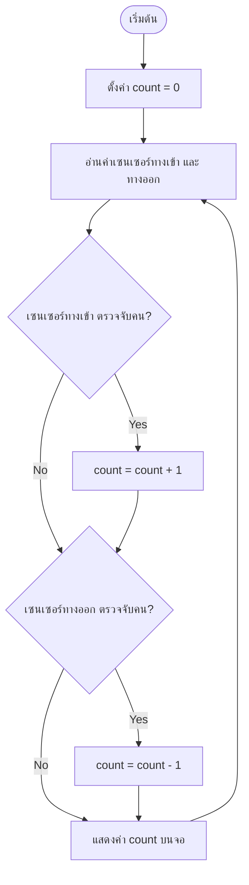

# ติวสอบ Microcontroller: ESP32 (ภาษา C)

## สารบัญ
1. GPIO
2. RTOS (จากเอกสารการทดลอง)
3. อ่านโค้ด: จุดผิดที่พบบ่อย (สำหรับคนไม่มีพื้นฐาน C)
4. Flowchart: หลักการวาด + ตัวอย่าง

---

## 1. GPIO (General Purpose Input/Output)

GPIO คือขาที่ใช้รับ-ส่งสัญญาณดิจิทัล (0 หรือ 1) ระหว่างไมโครคอนโทรลเลอร์กับอุปกรณ์ภายนอก เช่น LED, ปุ่มกด, เซนเซอร์

### โหมดการทำงานของขา (Pin Mode)

| โหมด | ความหมาย | ใช้เมื่อ |
|---|---|---|
| OUTPUT | ขาส่งสัญญาณออก | ควบคุม LED, มอเตอร์, relay |
| INPUT | ขารับสัญญาณเข้า | อ่านค่าจากปุ่มกด/เซนเซอร์ |
| INPUT_PULLUP | ขารับสัญญาณเข้า + มีตัวต้านทานดึงขึ้นภายใน | ปุ่มกดที่ไม่ต่อ pull-up ภายนอก (ค่าปกติเป็น 1 กดแล้วเป็น 0) |
| INPUT_PULLDOWN | ขารับสัญญาณเข้า + ตัวต้านทานดึงลงภายใน | ปุ่มกดแบบตรงข้าม (ค่าปกติเป็น 0) |

### ฟังก์ชันหลักที่ต้องรู้ (Arduino-style ใช้กับ ESP32 ได้)

```c
pinMode(pin, mode);        // ตั้งค่าขาว่าจะเป็น input หรือ output
digitalWrite(pin, value);  // สั่งขา output ให้เป็น HIGH (1) หรือ LOW (0)
int val = digitalRead(pin);// อ่านค่าขา input กลับมาเป็น HIGH หรือ LOW
analogRead(pin);           // อ่านค่าแรงดันแบบ analog (0-4095 บน ESP32 เพราะ ADC 12 บิต)
ledcWrite(channel, duty);  // สั่ง PWM ออกขา (ESP32 ไม่มี analogWrite แบบ Arduino ปกติ)
```

### ข้อควรระวังเฉพาะของ ESP32

- **GPIO 34-39**: ใช้เป็น INPUT ได้อย่างเดียว (ไม่มีวงจร pull-up/pull-down ภายใน ตั้งเป็น OUTPUT ไม่ได้)
- **Strapping pins (GPIO 0, 2, 12, 15)**: มีผลตอนบูตเครื่อง ควรเลี่ยงถ้าไม่จำเป็น
- **ADC2**: บาง GPIO ใช้ร่วมกับ WiFi พร้อมกันไม่ได้

### ตัวอย่างโครงสร้างโปรแกรมกะพริบ LED

```c
#define LED_PIN 2

void setup() {
  pinMode(LED_PIN, OUTPUT);   // ตั้งขา 2 เป็น output
}

void loop() {
  digitalWrite(LED_PIN, HIGH); // ไฟติด
  delay(1000);                 // หน่วง 1 วินาที
  digitalWrite(LED_PIN, LOW);  // ไฟดับ
  delay(1000);
}
```

**สิ่งที่ต้องเข้าใจ ไม่ใช่ท่องจำ:** ต้อง `pinMode` ก่อนใช้งานเสมอ, `digitalWrite` ใช้กับขาที่เป็น OUTPUT เท่านั้น, `digitalRead` ใช้กับขาที่เป็น INPUT เท่านั้น — สลับกันจะไม่ error ตอนคอมไพล์ แต่ทำงานผิดพลาด (จุดที่ข้อสอบมักออก)

---

## 2. RTOS (FreeRTOS) — สรุปจากเอกสารทดลอง

### FreeRTOS คืออะไร

ระบบปฏิบัติการแบบเรียลไทม์ (Real-Time Operating System) แบบโอเพนซอร์ส ออกแบบมาสำหรับไมโครคอนโทรลเลอร์และระบบฝังตัว ช่วยจัดการหลายงาน (multitasking) พร้อมกันอย่างมีประสิทธิภาพ เหมาะกับอุปกรณ์ที่ทรัพยากรจำกัด เช่น ESP32, STM32, RP2040

### คุณสมบัติ (ท่องเป็นหัวข้อ แล้วอธิบายได้ 1 ประโยค)

1. **Multitasking** — รันหลาย Task พร้อมกันได้
2. **Preemptive Scheduling** — ระบบสลับไป Task ที่ priority สูงกว่าได้ทันที แม้ Task เดิมยังไม่เสร็จ
3. **Cooperative Scheduling** — Task สลับกันทำงานเองโดยสมัครใจ ไม่แย่ง CPU
4. **Task Priority** — กำหนดลำดับความสำคัญของแต่ละ Task ได้
5. **Inter-Task Communication** — สื่อสารระหว่าง Task ด้วย Queue, Semaphore, Mutex, Event Group
6. **Software Timer** — ตั้งเวลาให้ฟังก์ชันทำงานได้
7. **Low Power Support** — จัดการพลังงานได้อย่างมีประสิทธิภาพ
8. **Portability** — ใช้ได้หลายแพลตฟอร์ม (ARM Cortex-M, ESP32, AVR, PIC)

### Task คืออะไร

Task = หน่วยการทำงานหลักของ FreeRTOS เปรียบเทียบได้กับ "โปรเซส" ในระบบปฏิบัติการทั่วไป แต่ละ Task ทำงานอิสระจากกัน และกำหนด priority ได้

### xTaskCreate() — ฟังก์ชันสร้าง Task ใหม่

ต้องระบุ 6 อย่าง (จุดที่ข้อสอบชอบถาม เรียงลำดับให้แม่น):

```c
xTaskCreate(
  vTaskFunction,  // 1. ฟังก์ชันที่ Task จะทำงาน
  "Task1",        // 2. ชื่อ Task
  2048,           // 3. ขนาด Stack (bytes)
  NULL,           // 4. พารามิเตอร์ที่จะส่งเข้าไปในฟังก์ชัน
  1,              // 5. ระดับความสำคัญ (priority)
  NULL            // 6. ตัวชี้ตำแหน่ง Task (task handle) ไว้อ้างอิงทีหลัง
);
```

จำง่ายๆ ด้วยลำดับ: **ฟังก์ชัน → ชื่อ → ขนาด stack → พารามิเตอร์ → priority → handle**

### ตัวอย่างโครงสร้างโค้ด (จากเอกสาร)

```c
void vTaskFunction(void *pvParameters) {
  while (1) {
    printf("Hello from Task!\n");
    vTaskDelay(1000 / portTICK_PERIOD_MS); // หน่วงเวลา 1 วินาที
  }
}

void app_main() {
  xTaskCreate(vTaskFunction, "Task1", 2048, NULL, 1, NULL);
}
```

**จุดสำคัญ:** `vTaskDelay` ต่างจาก `delay` ธรรมดาตรงที่ระหว่างรอ มันจะ "คืน CPU" ให้ Task อื่นทำงานต่อได้ (ไม่บล็อกทั้งระบบ) — นี่คือหัวใจของ RTOS ที่ทำให้ทำงานพร้อมกันหลาย Task ได้จริง

---

## 3. อ่านโค้ด: จุดผิดที่คนเรียน C ใหม่ๆ มักเจอ

ก่อนดูตัวอย่าง มาปูพื้นสัญลักษณ์ที่ต้องรู้ก่อน:

| สัญลักษณ์ | ความหมาย | จุดที่มักเข้าใจผิด |
|---|---|---|
| `=` | กำหนดค่า (assignment) | คนละความหมายกับ `==` |
| `==` | เปรียบเทียบว่าเท่ากันไหม | ใช้ในเงื่อนไข if |
| `;` | จบคำสั่ง | ลืมใส่ = บรรทัดถัดไปถูกนับผิดกลุ่ม คอมไพล์ error |
| `{ }` | ขอบเขตของ block คำสั่ง | ใช้กับ if, for, while, function |
| `//` หรือ `/* */` | คอมเมนต์ ไม่ใช่โค้ดที่รันจริง | ใช้อธิบายโค้ดเฉยๆ |

### ตัวอย่างที่ 1: โค้ดกะพริบ LED (มีจุดผิด)

```c
#define LED_PIN 2

void setup() {
  pinMode(LED_PIN, INPUT)     // (1) ผิด
  digitalWrite(LED_PIN, HIGH);
}

void loop() {
  digitalWrite(LED_PIN, HIGH);
  delay(1000)                 // (2) ผิด
  digitalWrite(LED_PIN, LOW);
  delay(1000);
}
```

**ผิดตรงไหน:**
- **(1)** `pinMode(LED_PIN, INPUT)` ลืมเซมิโคลอน `;` ต่อท้าย **และ** ตั้งเป็น `INPUT` ทั้งที่บรรทัดถัดมาจะสั่ง `digitalWrite` (ต้องเป็น `OUTPUT`) → แก้เป็น `pinMode(LED_PIN, OUTPUT);`
- **(2)** `delay(1000)` ลืมเซมิโคลอน `;` ต่อท้าย → แก้เป็น `delay(1000);`

**วิธีจับผิดแบบเร็ว:** ทุกบรรทัดที่ "สั่งให้ทำอะไรสักอย่าง" (ไม่ใช่หัวของ if/for/while/function) ต้องจบด้วย `;` เสมอ

### ตัวอย่างที่ 2: โค้ดอ่านปุ่มกด (มีจุดผิด)

```c
#define BUTTON_PIN 4
int count = 0;

void setup() {
  pinMode(BUTTON_PIN, INPUT_PULLUP);
  Serial.begin(115200);
}

void loop() {
  int state = digitalRead(BUTTON_PIN);
  if (state = LOW) {          // (1) ผิด
    count++;
    Serial.println(count)     // (2) ผิด
    delay(200);
  }
}
```

**ผิดตรงไหน:**
- **(1)** `if (state = LOW)` ใช้ `=` (กำหนดค่า) แทน `==` (เปรียบเทียบ) → ผลคือ `state` ถูกตั้งค่าเป็น `LOW` ทุกครั้ง เงื่อนไขเลยเป็นจริงตลอด (นับรัวๆ ไม่หยุด) → แก้เป็น `if (state == LOW)`
- **(2)** `Serial.println(count)` ลืมเซมิโคลอน → แก้เป็น `Serial.println(count);`

**เทคนิคจำ:** `if (x = y)` คือข้อผิดพลาดคลาสสิกของคนเรียน C ใหม่ — จำไว้ว่า "เงื่อนไขเปรียบเทียบต้องมี `==` สองตัวเสมอ"

---

## 4. Flowchart: หลักการวาด + ตัวอย่าง

### สัญลักษณ์พื้นฐานที่ต้องรู้

| รูปทรง | ความหมาย |
|---|---|
| วงรี (Oval) | จุดเริ่มต้น / จุดจบ (Start/End) |
| สี่เหลี่ยมผืนผ้า (Rectangle) | ขั้นตอนการประมวลผล (Process) |
| สี่เหลี่ยมขนมเปียกปูน (Diamond) | จุดตัดสินใจ (Decision) มีทางออก 2 ทาง เช่น Yes/No |
| สี่เหลี่ยมด้านขนาน (Parallelogram) | รับข้อมูลเข้า / แสดงผลออก (Input/Output) |
| ลูกศร (Arrow) | ทิศทางการทำงาน |

### ตัวอย่าง: เครื่องนับคนเข้าห้องน้ำ (2 เซนเซอร์: ทางเข้า-ทางออก)

**แนวคิด:** ใช้เซนเซอร์ 2 ตัว ตัวหนึ่งตรวจจับคนเดินเข้า อีกตัวตรวจจับคนเดินออก แล้วนับจำนวนคนในห้อง





**อธิบายการทำงาน:**
1. เริ่มต้น ตั้งค่าตัวนับ `count = 0`
2. วนอ่านค่าจากเซนเซอร์ทั้งสองตัวตลอดเวลา
3. ถ้าเซนเซอร์ทางเข้าตรวจจับคน → บวก `count` ขึ้น 1
4. ถ้าเซนเซอร์ทางออกตรวจจับคน → ลบ `count` ลง 1
5. แสดงค่า `count` บนจอแสดงผล (เช่น LCD หรือ 7-segment)
6. วนกลับไปอ่านเซนเซอร์ใหม่ (loop ตลอด)

**หลักการออกแบบ flowchart ในข้อสอบ (ใช้ได้กับทุกโจทย์ ไม่ใช่แค่ตัวอย่างนี้):**
- เริ่ม/จบ ต้องมีวงรีเสมอ 1 อัน
- ทุกจุดตัดสินใจ (diamond) ต้องมีทางออกอย่างน้อย 2 ทาง (Yes/No) และทุกทางต้องมีปลายทางชัดเจน ห้ามปล่อยลอย
- ถ้าโจทย์เป็นระบบที่ทำงานตลอดเวลา (เช่น เครื่องนับคน) ต้องมีลูกศรวนกลับไปจุดอ่านค่าใหม่ (loop) ไม่ใช่จบที่ End
- เขียนสั้น กระชับ ในแต่ละกล่อง 1 การกระทำ ไม่ยัดหลายคำสั่งในกล่องเดียว

---

## เคล็ดลับสรุปก่อนเข้าห้องสอบ

- **GPIO:** ต้อง pinMode ก่อนใช้เสมอ, digitalWrite ใช้กับ OUTPUT, digitalRead ใช้กับ INPUT
- **RTOS:** จำ 6 พารามิเตอร์ของ xTaskCreate ให้ได้ตามลำดับ, เข้าใจว่า vTaskDelay ไม่บล็อกทั้งระบบ
- **อ่านโค้ด:** เช็ค `;` ท้ายบรรทัดทุกครั้ง, เช็คว่าใช้ `==` ไม่ใช่ `=` ในเงื่อนไข if
- **Flowchart:** จำสัญลักษณ์ 4 แบบให้แม่น (วงรี / สี่เหลี่ยม / ข้าวหลามตัด / สี่เหลี่ยมด้านขนาน) และอย่าลืมลูกศร loop กลับถ้าโจทย์เป็นระบบทำงานต่อเนื่อง
